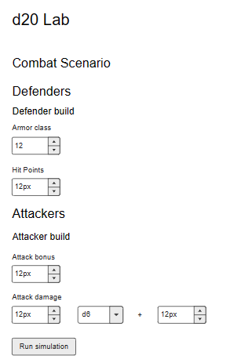
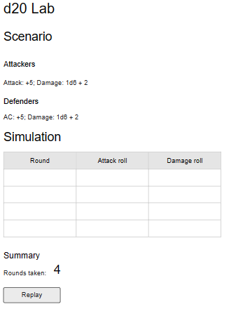

# Project notes

## Project goal

This project is done mainly to explore some ideas around visualization of d20 system math.

## Scope and purpose

d20Lab is a web application allowing to simulate simple combat scenarios in d20 gaming system and visualize impact of buffs and build differences.

## Domain
I will use much simplified concepts from d20 system that allow me to run simulations of d20 combat scenarios, but are also easy to model.

**Armor Class** - Armor class decides how difficult it is to hit a target.

**Attack Bonus** - Represents combat skill. It increases chance of hitting the target.

**Attack Roll** - 
1 on d20 always misses;
20 on d20 always hits;
if Attack Bonus + d20 >= Armor Class then the attack hits.

**Damage Dice** - Weapon-dependent formula of checking how much damage this weapon deals on hit.

**Damage Bonus** - Flat bonus amount of damage delt with every successful attack.

**Damage Roll** - DamageDelt = DamageDice + DamageBonus

**AttackerBuild** - A simplified model of character build equipped to attack; 

- AttackBonus
- DamageBonus
- DamageDice (dice type and count, for example 2d4)

**DefenderBuild** - A simplified model of character build that can be attacked:

- HitPoints
- ArmorClass

## Business 

**Scenario**
One or more attacker builds vs one or more defender builds

**Scenario Simulation**
Combat simulation where a Scenario is played through round by round until all defenders are defeated.

**Defender**
A character to defeated in a simulation. Enemy is characterized by armor class, max hit points and current hit points.

**Attacker**
A character that attempts to defeat all Defenders in a simulation.

## Domain & Bussiness Model

After second version, we should have a following structure.

## Release plan

- First version will only allow to setup one build for attacker and one defender. 
The user can run a simulation and see a simulation page with log of combat rounds. 
This will require implementing core domain data types and rules engine, 
with a very simple user interface.
- Second version will allow running N number of simulations 
and show a distribution of number of rounds it took to complete the challenge.
This version will require adding a graph library.
- Thid version will allow adding more builds to compare. 
Each build will get a label and a random color.
It will also add a real-time preview of results based on calculation of averages.
- Fourth version will allow for buffing up during combat. 
Every build can use some of initial rounds of combat to buff up, instead of attacking. 
Only attack bonus and damage bonus buffs will be available.
- Fifth version will allow for building parties of up to 6 builds in each scenario.

## First version

### Technical solution

- Server-side Blazor app with Tailwind instead of Bootstrap

### App design

#### Scenario setup page

#### Scenario simulation page

- No input validation in this iteration
- Simulation results are always shown and present results of last run simulation.
- If no simulation was yet run a text message is shown instead of table and summary.

### Technical design

We can identify following boundaries:

- d20 rules, which is our core business logic
- simulation engine, which is a part of application logic
- main page, which is our main view
- SimulationSetupState, which is a part of application state, keeping track of current setup for next simulation
- SimulationResultsState, which is also a part of application state and it remembers both the results of last run simulation and setup used.

We can also identify following view components:

- SimulationSetup
- Challenge
- Enemy
- Scenario
- Hero build
- Simulation
- CombatLog
- CombatSummary

Our source code organization may look something like this:

- ...
- src
  - domain
    - d20.ts
  - simulation
    - model
      - simulation_setup_state.ts
      - simulation_results_state.ts
      - simulation_engine.ts
    - components
      - SimulationSetupProvider.tsx
      - Enemy.tsx
      - Challenge.tsx
      - Scenario.tsx
      - HeroBuild.tsx
      - AttackDamage.tsx
      - SimulationResults.tsx
      - CombatLog.tsx
      - CombatSummary.tsx

### Backlog

- tests for d20 rules
- implementation of d20 rules
- tests for simulation engine
- implementation of simulation engine
- main page layout
- split layout to components
- simulation context and provider
-
