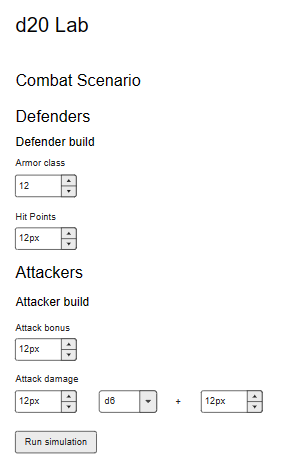
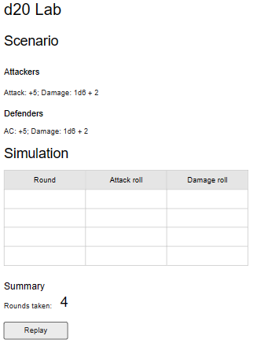

## d20TG v01

### Technical solution

- Client-side Blazor app with Tailwind instead of Bootstrap

### App design

#### Scenario setup page

#### Scenario simulation page

- No input validation in this iteration
- Simulation results are always shown and present results of last run simulation.
- If no simulation was yet run a text message is shown instead of table and summary.

### Technical design

We can identify following boundaries:

- d20 rules, which is our core business logic
- simulation engine, which is a part of application logic
- main page, which is our main view
- SimulationSetupState, which is a part of application state, keeping track of current setup for next simulation
- SimulationResultsState, which is also a part of application state and it remembers both the results of last run simulation and setup used.

We can also identify following view components:

- SimulationSetup
- Challenge
- Enemy
- Scenario
- Hero build
- Simulation
- CombatLog
- CombatSummary

Our source code organization may look something like this:

- ...
- src
  - domain
    - d20.ts
  - simulation
    - model
      - simulation_setup_state.ts
      - simulation_results_state.ts
      - simulation_engine.ts
    - components
      - SimulationSetupProvider.tsx
      - Enemy.tsx
      - Challenge.tsx
      - Scenario.tsx
      - HeroBuild.tsx
      - AttackDamage.tsx
      - SimulationResults.tsx
      - CombatLog.tsx
      - CombatSummary.tsx
